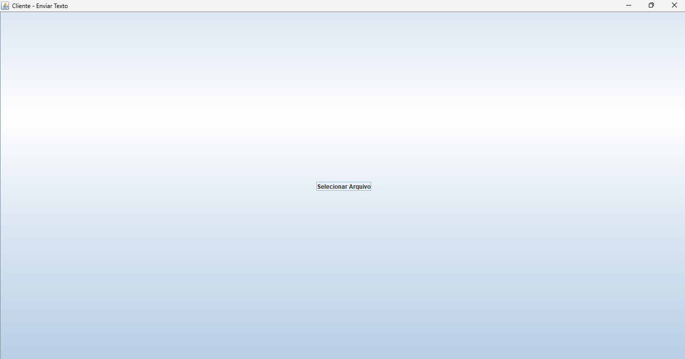
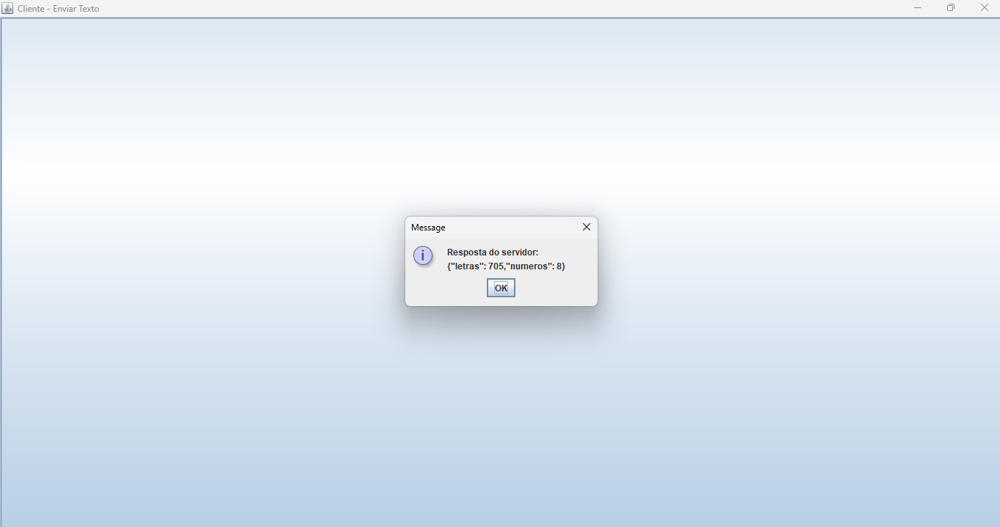

# 💻 Sistema Distribuído em Java - Arquitetura Mestre-Escravo

Este projeto implementa um sistema distribuído utilizando **Java puro**, **threads**, comunicação **HTTP REST**, **interface gráfica (Swing)** e **containers Docker**, seguindo uma arquitetura **Mestre-Escravo**.

---

## 🎯 Objetivo

> Implementar um sistema distribuído todo em Java puro usando threads e containers Docker, seguindo uma arquitetura mestre-escravo.

---

## 🧱 Arquitetura

- **Cliente (Notebook 1)**  
  Interface gráfica em Java Swing que envia um arquivo `.txt` para o Mestre. O cliente **não processa os dados**, apenas envia e exibe o resultado.

- **Mestre (Container)**  
  Recebe o texto do cliente via HTTP, cria duas threads paralelas e envia o conteúdo para os escravos. Junta os resultados e retorna ao cliente.

- **Escravo Letras (Container)**  
  Recebe o texto e retorna a quantidade de letras.

- **Escravo Números (Container)**  
  Recebe o texto e retorna a quantidade de números.

---

## ⚙️ Tecnologias utilizadas

- Java 11 (puro)
- Threads Java
- `HttpServer` embutido (sem frameworks externos)
- Swing (interface gráfica)
- Docker + Docker Compose

---

## 🔁 Fluxo de execução

1. Cliente seleciona um arquivo `.txt` com letras e números.
2. Cliente envia o conteúdo para o Mestre (`/processar`).
3. Mestre verifica se cada escravo está disponível (`/status`).
4. Mestre envia o texto para:
   - Escravo Letras → `/letras`
   - Escravo Números → `/numeros`
5. Cada escravo responde com um JSON.
6. Mestre junta os resultados e devolve ao cliente.

---

## 🐳 Executando com Docker

> Pré-requisitos: Docker e Docker Compose instalados.

## 📸 Prints da Interface

## 📄 Licença
Este projeto está sob a licença MIT. Veja o arquivo **LICENSE** para mais detalhes.